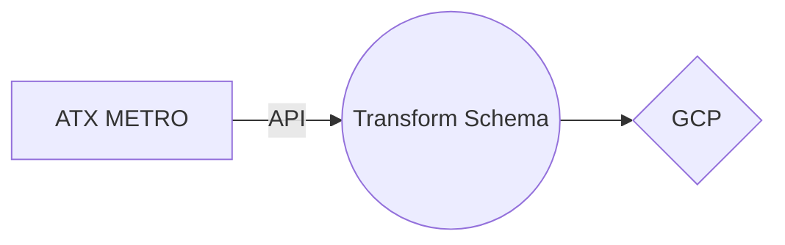

## Description
This ETL is loading data from an API call into a BigQuery table. It is importing necessary modules, setting up credentials, setting up the BigQuery table and schema, and making the API request to load the data. It is also converting the data to the correct data types before loading it into the table.

# Metro Rail ETL v1

This Python script retrieves data on ridership from the Texas Government Data API and loads it into a Google BigQuery table. The data is cleaned, transformed, and loaded into a properly formatted DataFrame before being uploaded to BigQuery.

## Dependencies

- datetime
- time
- pandas
- requests
- jsongit 
- logging
- pytz
- pyarrow
- google-auth
- google-cloud-bigquery

## Usage

1. Replace the `key_path` variable with the path to your Google Cloud Service Account key JSON file.
2. Set the `project_id`, `dataset_id`, and `table` variables according to your BigQuery project settings.
3. Run the script to fetch data from the API and load it into the specified BigQuery table.

## Functions

- `load_table_dataframe(key_path, project_id, table_id)`: Fetches data from the Texas Government Data API, cleans and transforms it, creates a DataFrame, and loads it into the specified BigQuery table.

## License

MIT License

ETL flow chart:

