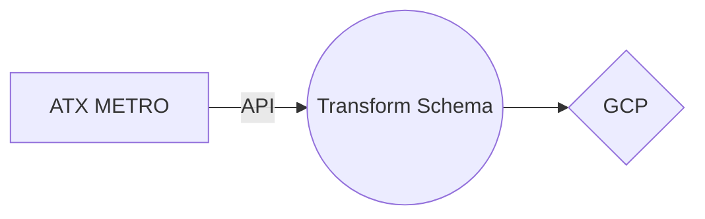

## Description
This ETL is loading data from an API call into a BigQuery table. It is importing necessary modules, setting up credentials, setting up the BigQuery table and schema, and making the API request to load the data. It is also converting the data to the correct data types before loading it into the table.

ETL flow chart:

**Problem**

The city transit authority consistently generates and updates data on metro rail ridership, which is crucial for planning, budget allocation, and infrastructure development. However, this data is currently accessed through a public API and isn't easily integrated with our internal data systems for comprehensive analysis. This manual process is labor-intensive, time-consuming, and prone to human error.

**Ideal Solution**

Our goal is to automate the process of data acquisition, transformation, and loading into a more robust and scalable system like Google BigQuery. By doing this, we can ensure accurate, timely data that can be seamlessly integrated with our other data sources for comprehensive analysis.

**ETL Implementation**

To automate the data acquisition, transformation, and loading (ETL) process, we propose to use Python scripts that will:

1. **Extract**: The script will fetch data from the public API where the metro rail ridership data is hosted.
2. **Transform**: The script will convert the received data into the correct format and data types that align with our BigQuery table schema.
3. **Load**: The data will then be loaded into a Google BigQuery table within our project. 

This ETL pipeline will run automatically to ensure our BigQuery table is always up-to-date with the latest metro rail ridership data.

**Data Insights**

Once the ETL process is in place and data is loaded in BigQuery, we will be able to run SQL queries to analyze the data and gain valuable insights, such as:

- *Ridership trends*: Understanding the patterns and trends in ridership can help us optimize scheduling, plan for peak times, and identify low-usage periods.
- *Route analysis*: By analyzing the ridership data per route, we can identify which routes are most popular and which are underutilized. This can guide infrastructure development and resource allocation.
- *Fiscal analysis*: We can compare the ridership data against the fiscal data to understand the revenue generated versus the operating costs.
- *Forecasting*: With historical ridership data, we can predict future trends using machine learning models, helping with long-term planning and strategy.

By solving this problem, we can ensure that our decision-making is data-driven, accurate, and timely, leading to improved services and efficient resource allocation.

# Metro Rail ETL v1

This Python script retrieves data on ridership from the Texas Government Data API and loads it into a Google BigQuery table. The data is cleaned, transformed, and loaded into a properly formatted DataFrame before being uploaded to BigQuery.

## Dependencies

- datetime
- time
- pandas
- requests
- jsongit 
- logging
- pytz
- pyarrow
- google-auth
- google-cloud-bigquery

## Usage

1. Replace the `key_path` variable with the path to your Google Cloud Service Account key JSON file.
2. Set the `project_id`, `dataset_id`, and `table` variables according to your BigQuery project settings.
3. Run the script to fetch data from the API and load it into the specified BigQuery table.

## Functions

- `load_table_dataframe(key_path, project_id, table_id)`: Fetches data from the Texas Government Data API, cleans and transforms it, creates a DataFrame, and loads it into the specified BigQuery table.

## License

MIT License

